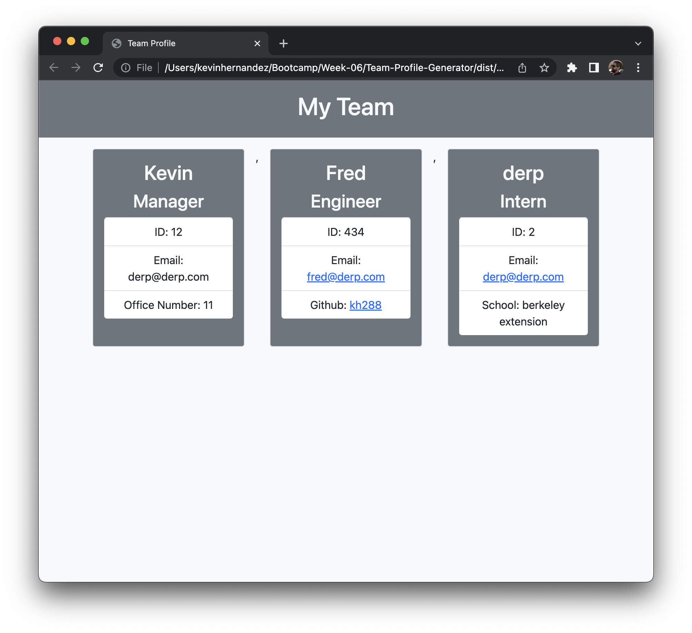
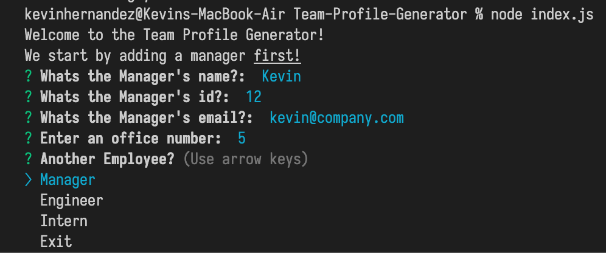

# Team Profile Generator 

## Description
This app is designed to have a visual layout for the team you want to build. As a manager it'll be easier to get your team visualized in one place with this app!

## Table of Contents
* [Description](#description)
* [Installation](#installation)
* [Tests](#tests)
* [Questions](#questions)

## Installation
In order to use this, simply clone down the from this repository, and navigate to the directory where it's cloned, and run the command 'npm install' to install the proper dependencies. Once that's complete run 'node index.js'

## Tests
Tests were done to all the major class files
https://watch.screencastify.com/v/zCMyjvyn19jTSdUe8adC

## Questions
For questions, reach me at my github: https://github.com/kh288